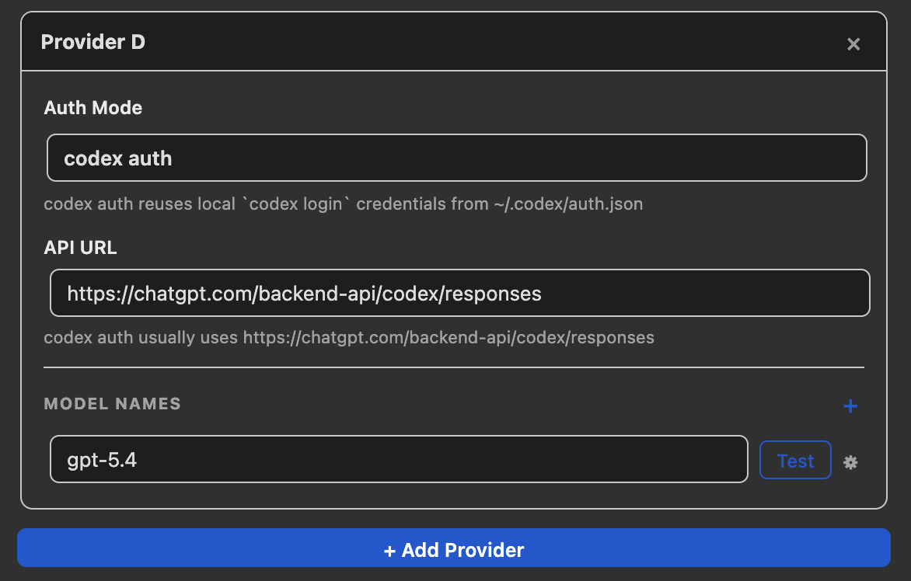

# llm-for-zotero: Your Right-Hand Side AI Research Assistant

[](https://www.zotero.org)
[](https://www.zotero.org)
[](https://github.com/windingwind/zotero-plugin-template)

<p align="center">
  
</p>


## 🚀 This plugin is now renamed to LLM-for-Zotero

Please see the latest [release notes](https://github.com/yilewang/llm-for-zotero/releases). The plugin name is now changed to `llm-for-zotero`.


## Update: ChatGPT Plus subscription users can use their Codex quote to access Codex models (e.g. `gpt-5.4`) without an API key. Please see the [Usage Guide](#usage-guide) for more details. 

## Introduction

**llm-for-zotero** is a powerful plugin for [Zotero](https://www.zotero.org/) that integrates Large Language Models (LLMs) directly into the Zotero PDF reader. Unlike other tools that require you to upload your pdfs to a portal, this plugin is designed to conveniently access LLMs without the need to leave Zotero. It quietly sits in the panel of the Zotero reader, like your standby research assistant, ready to help you with any questions you have when reading a paper.


<p align="center">
  
</p>


## Key Features

### 1. "Everything starts with: Summarize this paper for me"

<p align="center">
  
</p>

It is always the first question that comes to mind when you open a new paper. With this plugin, you can get a concise summary of the paper in seconds, without having to read through the entire text. You can always find the relevant information you need, and quickly decide whether this paper is worth your time. The summary is generated based on the full content of the paper currently open in your Zotero reader, so you can be sure that the information is accurate and relevant. You can also customize the summary prompt to fit your specific research needs, such as focusing on the methodology, results, or implications of the paper.

### 2. "Explain this selected text for me"


<p align="center">
  
</p>


If you come across a complex paragraph or a technical term that you don't understand, simply select the text and ask the model to explain it. 

You can select up to 5 contexts from both model's answer and the paper content to provide more context for the model to generate a more accurate and detailed explanation.

In the plugin, you can enable the pop-up option to conveniently add text to the chat.

**If you don't like it, that's totally fine. You can always disable it in the settings! I really think it is important to give you the choice.**

When you start your chat with the model, the full context of this paper is loaded into the model on the first turn. Follow-up questions switch to focused retrieval from the same paper, so the selected text becomes an additional layer of context that helps the model give a more accurate and detailed explanation without resending the whole paper each time.

### 3. "What does this figure mean?"

<p align="center">
  
</p>

In our research, understanding the figures equivalent to understanding the paper. With this plugin, you can take a screenshot of any figure in the paper and ask the model to interpret it for you. It supports up to 10 screenshots at a time.


### 4. "Wait.. How this paper is related to another paper?"

<p align="center">
  
</p>

In this plugin, you can open multiple papers in different tabs and ask the model to read and compare the papers for you. You can simply type `/` to cite the other paper as additional context. 

### 5. "I have another document that is not in my Zotero, can you also read it for me?"

<p align="center">
  
</p>

Not limited by the papers in your Zotero library, you can also upload any document from your local drive to the model as additional context. The supported file types include PDF, DOCX, PPTX, TXT, and markdown files. This feature is developed by coder contributor [@jianghao-zhang](https://github.com/jianghao-zhang). Kudos to him! 

### 6. "This answer is nice, I want to save it into my note"

<p align="center">
  
</p>

This plugin supports seamless integration with your note-taking workflow. You can easily save an answer, or selected text generated by the model into your Zotero notes with just one click.

### 7. "I learned a lot from talking to you, I wish I could come back to it later"

<p align="center">
  
</p>

The local conversation history is automatically saved and associated with the paper you are reading. You can also export the whole conversation into your note with markdown format. I spent a plenty amount effort to make sure the mathematical equations rendering is correct in the exported markdown, so complex knowledge will be presented in the most clear way in your note.

**The export to note function also supports saving the selected text and screenshots into your note with markdown format. So, you never lose context.**


### 8. "Do you remember my preference?"

<p align="center">
  
</p>

You can customize the quick-action presets to fit your specific research workflow.

### 9. "Time to upgrade you, solider"
<p align="center">
  
</p>

You can set up multiple provider connections, and each provider can include multiple LLM models to help you handle different types of tasks. For instance,

- the multimodal model for helping you to interpret the Figure;
- text-based model for helping you understand text.

Different models can also be used for the same task, and you can cross check their answers to get a more comprehensive understanding of the paper.

If you want more customization, you can also set up different reasoning levels for the same model in the conversation panel, such as "default", "low", "medium", "high" and "xhigh" for `gpt-5.4`, "medium", "high" and "xhigh" for `gpt-5.4-pro`, "low" and "high" for `gemini-3-pro-preview`, "medium" for `gemini-2.5-flash`. You can always check the connections by clicking the "Test Connection" button in the settings.

If you are a pro player, you can also change some hyperparameters of the model, such as temperature, max_tokens_output, etc. to get more creative or more deterministic answers.

### 10. "Can you upgrade yourself?"

<p align="center">
  
</p>

The plugin will automatically check for updates when you open Zotero. If I release an update, you will be able to update the plugin with just one click, without having to go through the installation process again. This way, you can always enjoy the latest features and improvements without any hassle.

### Migration note for existing users

The public plugin name is now `llm-for-zotero`.
To keep auto-update seamless for existing installs, the internal add-on ID remains unchanged from earlier releases.
User settings and local chat history are migrated automatically on startup.

### Installation

#### Step 1: Download the latest `.xpi` release

Download the latest `.xpi` release from the [Releases Page](https://github.com/yilewang/llm-for-zotero/releases).

Open `Zotero` and go to `Tools -> Add-ons`.

#### Step 2: Install the `.xpi` file

Click the gear icon and select `Install Add-on From File`

#### Step 3: Restart `Zotero`

Select the `.xpi` file and restart `Zotero` to complete the installation.

### Configuration

Open `Preferences` and navigate to the `llm-for-zotero` tab.

Select your Provider (e.g., OpenAI, Gemini, Deepseek).

Paste your API Base URL, secret key and model name.

This plugin also supports **codex auth** mode (ChatGPT/Codex login reuse) for Codex models:

1. Run `codex login` on your machine first.
2. In plugin settings, set provider **Auth Mode** to `codex auth`.
3. Use API URL `https://chatgpt.com/backend-api/codex/responses` and a Codex model (e.g. `gpt-5.4`).

codex auth v1 notes:

- The plugin reads local credentials from `~/.codex/auth.json` (or `$CODEX_HOME/auth.json`).
- If request returns 401, the plugin attempts token refresh automatically.
- Embeddings are not supported in codex auth mode yet.
- Local PDF/reference text grounding and screenshot/image inputs are supported in codex auth mode.
- Only Responses `/files` upload + `file_id` attachment flow is not supported in codex auth mode yet.

I will give some popular model as example:

| API url                                                                  | Model Name           | Reasoning Level              |
| ------------------------------------------------------------------------ | -------------------- | ---------------------------- |
| https://api.openai.com/v1/chat/completions                               | gpt-5.4              | default, low, medium, high, xhigh |
| https://api.openai.com/v1/responses                                      | gpt-5.4              | default, low, medium, high, xhigh |
| https://api.openai.com/v1/responses                                      | gpt-5.4-pro          | medium, high, xhigh |
| https://api.deepseek.com/v1/chat/completions                             | deepseek-chat        | default                      |
| https://api.deepseek.com/v1/chat/completions                             | deepseek-reasoner    | default                      |
| https://generativelanguage.googleapis.com/v1beta/openai/chat/completions | gemini-3-pro-preview | low, high                    |
| https://generativelanguage.googleapis.com/v1beta/openai/chat/completions | gemini-2.5-flash     | medium                       |
| https://api.moonshot.ai/v1                                               | kimi-k2.5            | default                      |

You can always check the connections by clicking the "Test Connection" button.

### Usage Guide

To chat with a paper, open any PDF in the Zotero reader.

Open the LLM Assistant sidebar (click the distinct icon in the right-hand toolbar).

Type a question in the chat box, such as "What is the main conclusion of this paper?"

### A special feature for users with ChatGPT Plus subscription

We know token consumption is a big concern for many users. If you have a ChatGPT Plus subscription, you can use **Codex auth** mode to access Codex models (e.g. `gpt-5.4`) without an API key. The plugin reuses your ChatGPT login via the Codex CLI. This is a great way to save your tokens. Special thanks to [@jianghao-zhang](https://github.com/jianghao-zhang) for their valuable contributions to this project.

**Step-by-step setup (including new computers):**

1. **Install the Codex CLI** (one-time setup). You need Node.js 18+ first. If you don't have Node.js:
   - **macOS:** Install [Node.js](https://nodejs.org/) or run `brew install node`, then:
     ```bash
     npm install -g @openai/codex
     ```
   - **macOS (Homebrew):** Alternatively, `brew install --cask codex` (no Node.js needed).
   - **Windows/Linux:** Install [Node.js](https://nodejs.org/), then run `npm install -g @openai/codex`.

2. **Log in with your ChatGPT account.** Open a terminal and run:
   ```bash
   codex login
   ```
   A browser window will open. Sign in with the same ChatGPT Plus account you use at chatgpt.com. When done, credentials are saved to `~/.codex/auth.json`.

3. **Configure the plugin.** In Zotero → Preferences → llm-for-zotero:
   - Set provider **Auth Mode** to `codex auth`.
   - Set **API URL** to `https://chatgpt.com/backend-api/codex/responses`.
   - Set **Model** to a Codex model (e.g. `gpt-5.4`).
   - Click **Test Connection** to verify.

<p align="center">
  
</p>


### FAQ

> Q: Is it free to use?

A: Yes, absolutely free. You only pay for API calls, if you choose to use a paid API provider. And now, you can even use Codex models (e.g. `gpt-5.4`) from your ChatGPT Plus subscription without an API key. If you find this tool helpful, please consider leaving a ⭐ on GitHub or buying me a coffee via [Buy Me a Coffee](https://buymeacoffee.com/yat.lok) / Alipay. Either way is greatly appreciated!

<p align="center">
  
</p>


> Q: Does this work with local models?

A: Actually, yes. As long as the local model provides an OpenAI compatible HTTP API that is compatible with the plugin, you can connect it by entering the appropriate API Base URL and secret key in the settings.

> Q: Is my data used to train models?

A: No. Since you use your own API key, your data privacy is governed by the terms of the API provider you choose (e.g., OpenAI Enterprise terms usually exclude training on API data).

> Q: If I have any questions, how to contact you?

A: Please feel free to open an issue on GitHub! I will try my best to help you.


### GitHub star history

[](https://www.star-history.com/?repos=yilewang%2Fllm-for-zotero&type=date&legend=top-left)
